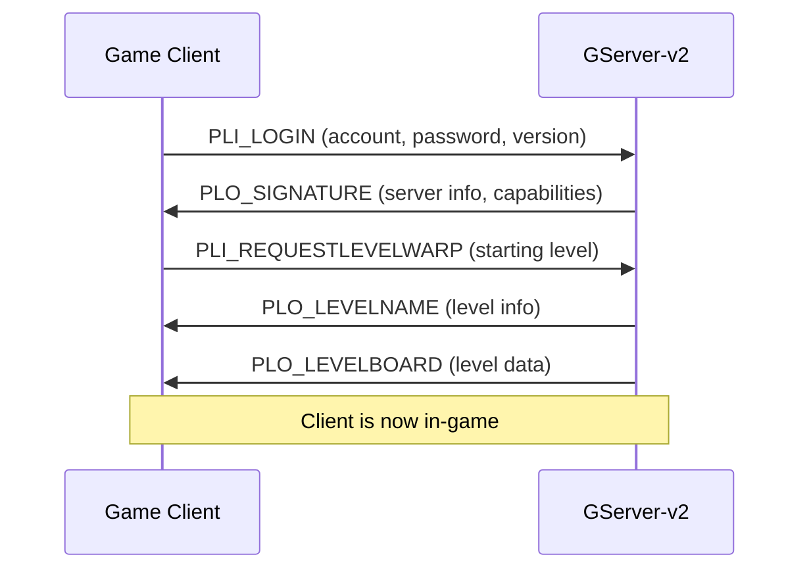
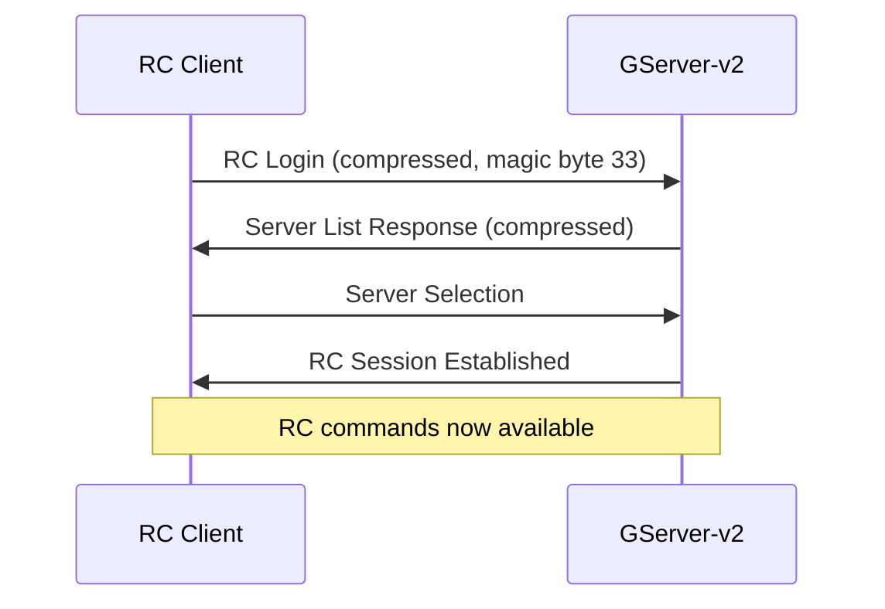
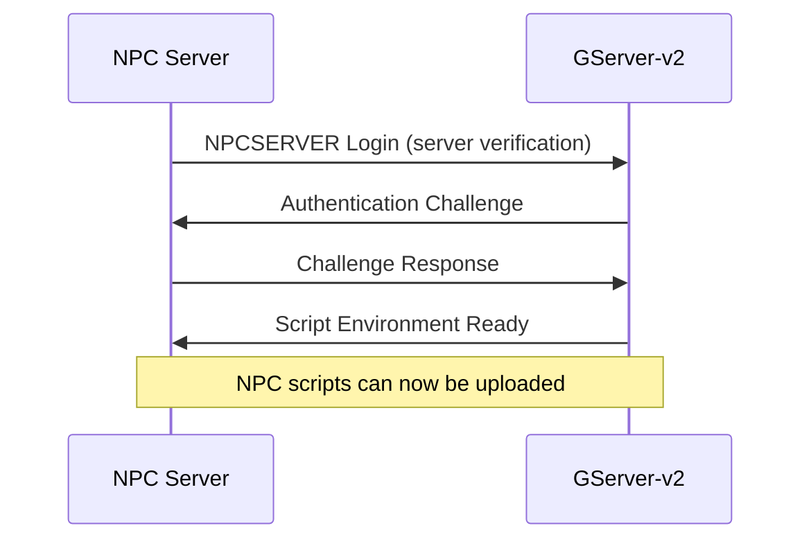

# Client Types in GServer-v2

GServer-v2 supports multiple distinct client types, each with specialized protocols, authentication methods, and capabilities. Understanding these differences is crucial for development and administration.

## Overview

The server identifies client types during the initial handshake based on packet format, magic bytes, and protocol version strings. Each client type has different:

- **Authentication flow**
- **Packet format and compression**
- **Available commands and features**
- **Privilege levels and restrictions**

## Client Type Summary

| Client Type | Purpose | Protocol | Compression | Authentication |
|-------------|---------|----------|-------------|----------------|
| **CLIENT** | Legacy game clients | Binary, little-endian | Optional | Account/Password |
| **CLIENT3** | Modern game clients | Binary, little-endian | Optional | Account/Password + Version |
| **WEB** | Web-based players | Binary, extended headers | Optional | Web-specific auth |
| **RC** | Remote Control/Admin | Binary, big-endian | **Required** | Admin credentials |
| **NPCSERVER** | Scripted NPCs | Binary, server-to-server | Conditional | Server verification |
| **NC** | Level Editor/Dev Tools | Binary, extended | Optional | Developer access |

## Detailed Client Types

### 🎮 [Game Clients](game-clients.md)
**Purpose**: Regular players connecting to play the game

**Variants**:
- **CLIENT**: Original Graal client (v1.41.1 era)
- **CLIENT3**: Modern clients (v2.22+) with extended features
- **WEB**: Browser-based clients with web-specific optimizations

**Key Features**:
- Player movement and interaction
- Chat and social features
- Inventory and item management
- Level exploration and progression
- Combat and weapon systems

### 🛠️ [Remote Control (RC)](remote-control.md)
**Purpose**: Server administration and monitoring

**Key Features**:
- Real-time player monitoring
- Server configuration management
- Chat moderation and logging
- Player account administration
- Server performance metrics
- Level and content management

**Protocol Specifics**:
- **Mandatory zlib compression** on all packets
- **Big-endian length headers** (network byte order)
- **Extended administrative packet set**
- **Enhanced authentication with session management**

### 🤖 [NPC Server](npc-server.md)
**Purpose**: Automated NPCs with scripting capabilities

**Key Features**:
- V8 JavaScript execution environment
- Event-driven NPC behavior
- Player interaction handling
- Server-side game logic
- Quest and dialogue systems
- Dynamic content generation

**Protocol Specifics**:
- **Server-to-server authentication**
- **Script upload and hot-reload**
- **Performance monitoring and limits**
- **Sandboxed execution environment**

### 💻 [NC Clients](nc-clients.md)
**Purpose**: Level editing and development tools

**Key Features**:
- Real-time level editing
- Tile and object placement
- NPC and script management
- Collaborative editing
- Version control integration
- Asset management

## Protocol Detection

The server determines client type using this decision tree:

```cpp
ClientType detectClientType(const PacketBuffer& initial_packet) {
    // Check for RC client (magic byte 33)
    if (initial_packet[0] == 33) {
        return ClientType::RC;
    }
    
    // Check for NPC server connection
    if (initial_packet.contains("NPCSERVER")) {
        return ClientType::NPCSERVER;
    }
    
    // Parse protocol version string
    std::string version = extractVersionString(initial_packet);
    
    if (version.starts_with("GNW")) {
        if (version >= "GNW22122") {
            return ClientType::CLIENT3;  // Modern client
        } else {
            return ClientType::CLIENT;   // Legacy client
        }
    }
    
    if (version.starts_with("GWEB")) {
        return ClientType::WEB;
    }
    
    if (version.starts_with("NC")) {
        return ClientType::NC;
    }
    
    // Default fallback
    return ClientType::CLIENT;
}
```

## Authentication Flows by Client Type

### Game Client Authentication


### RC Client Authentication


### NPC Server Authentication


## Packet Format Differences

### Game Clients (CLIENT/CLIENT3)
```
┌─────────────┬─────────────┬─────────────────────┐
│   Length    │    Type     │        Data         │
│  (2 bytes)  │  (1 byte)   │    (variable)       │
│ Little-End  │   +32 enc   │   Optional comp     │
└─────────────┴─────────────┴─────────────────────┘
```

### RC Clients
```
┌─────────────┬─────────────┬─────────────────────┐
│   Length    │    Type     │        Data         │
│  (2 bytes)  │  (1 byte)   │    (variable)       │
│  Big-Endian │   Raw byte  │  Mandatory zlib     │
└─────────────┴─────────────┴─────────────────────┘
```

### NPC Server
```
┌─────────────┬─────────────┬─────────────────────┐
│   Length    │    Type     │        Data         │
│  (4 bytes)  │  (2 bytes)  │    (variable)       │
│   Platform  │  Extended   │   Script payload    │
└─────────────┴─────────────┴─────────────────────┘
```

## Capability Matrix

| Feature | CLIENT | CLIENT3 | WEB | RC | NPCSERVER | NC |
|---------|--------|---------|-----|----|-----------|----|
| **Basic Gameplay** | ✅ | ✅ | ✅ | ❌ | ❌ | ❌ |
| **Chat** | ✅ | ✅ | ✅ | ✅ | ✅ | ✅ |
| **Level Editing** | ❌ | ❌ | ❌ | ✅ | ❌ | ✅ |
| **Player Admin** | ❌ | ❌ | ❌ | ✅ | ❌ | ❌ |
| **Script Upload** | ❌ | ❌ | ❌ | ✅ | ✅ | ✅ |
| **File Transfer** | ❌ | ✅ | ✅ | ✅ | ✅ | ✅ |
| **Real-time Monitor** | ❌ | ❌ | ❌ | ✅ | ❌ | ❌ |
| **Multi-server** | ✅ | ✅ | ✅ | ✅ | ✅ | ❌ |

## Implementation Examples

### Game Client Connection (Python)
```python
import struct
import socket

def connect_game_client(host, port, account, password):
    sock = socket.socket(socket.AF_INET, socket.SOCK_STREAM)
    sock.connect((host, port))
    
    # Build PLI_LOGIN packet
    packet = b''
    packet += bytes([0x20])  # PLI_LOGIN (0 + 32)
    
    # Account
    packet += bytes([len(account) + 32])
    packet += account.encode('utf-8')
    
    # Password  
    packet += bytes([len(password) + 32])
    packet += password.encode('utf-8')
    
    # Version
    version = "GNW22122"
    packet += bytes([len(version) + 32])
    packet += version.encode('utf-8')
    
    # Send with length header (little-endian)
    header = struct.pack('<H', len(packet))
    sock.send(header + packet)
    
    return sock
```

### RC Client Connection (Python)
```python
import struct
import socket
import zlib

def connect_rc_client(host, port, account, password):
    sock = socket.socket(socket.AF_INET, socket.SOCK_STREAM)
    sock.connect((host, port))
    
    # Build RC login packet
    packet = chr(33)  # Magic byte
    packet += chr(len(account) + 32) + account
    packet += chr(len(password) + 32) + password
    packet += "\n"
    
    # Compress and send with big-endian header
    compressed = zlib.compress(packet.encode('utf-8'))
    header = struct.pack('!H', len(compressed))  # Big-endian
    sock.send(header + compressed)
    
    return sock
```

## Security and Permissions

### Permission Levels
```cpp
enum PermissionLevel {
    NORMAL_PLAYER = 0,      // Basic game access
    TRUSTED_PLAYER = 1,     // Extended features
    GUILD_LEADER = 2,       // Guild management
    EVENT_COORDINATOR = 3,  // Event hosting
    LEVEL_ADMIN = 4,        // Level editing
    GLOBAL_ADMIN = 5,       // Server administration
    SUPER_ADMIN = 6,        // Full access
    SYSTEM = 7              // Internal system level
};
```

### Client-Specific Restrictions
- **Game Clients**: Limited to gameplay actions, cannot access admin functions
- **RC Clients**: Full administrative access based on account permissions
- **NPC Server**: Sandboxed script execution, limited file system access
- **NC Clients**: Level editing permissions, version control access

## Troubleshooting Client Connections

### Common Issues

1. **Authentication Failures**
   - Wrong packet format for client type
   - Incorrect compression settings
   - Invalid credentials or permissions

2. **Protocol Mismatches**
   - Client version not supported
   - Missing required capabilities
   - Incompatible packet encoding

3. **Network Issues**
   - Firewall blocking connections
   - MTU size problems with large packets
   - Compression/decompression errors

### Debugging Tips

1. **Enable Protocol Logging**
   ```cpp
   // In server configuration
   enable_packet_logging = true;
   log_level = DEBUG;
   ```

2. **Analyze Initial Handshake**
   ```bash
   # Capture with tcpdump
   tcpdump -i any -s 0 -w graal.pcap port 2001
   ```

3. **Verify Client Type Detection**
   ```cpp
   // Add logging in TServer::clientConnected()
   LOG_DEBUG("Detected client type: %d", static_cast<int>(client_type));
   ```

---

*Understanding the different client types and their protocols is essential for developing compatible tools, debugging connection issues, and properly configuring server permissions.*